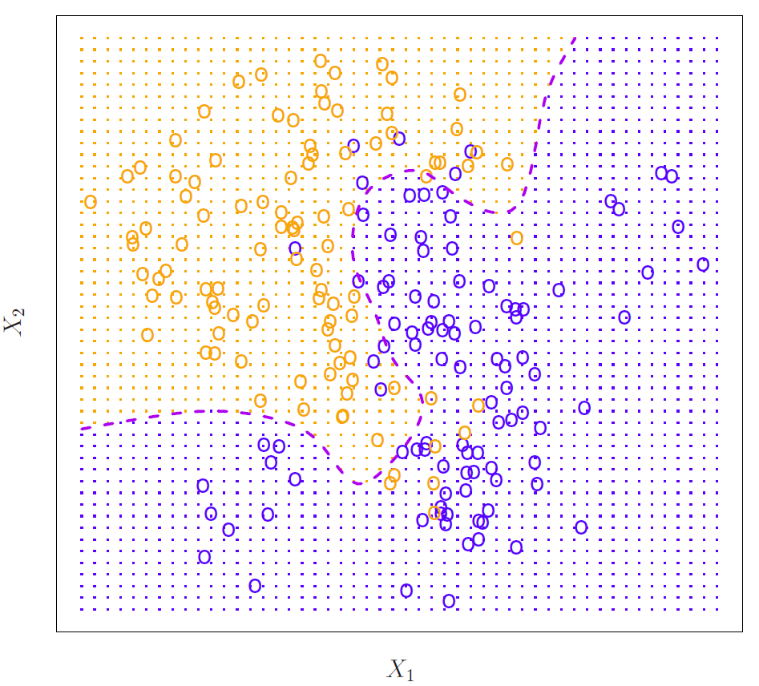
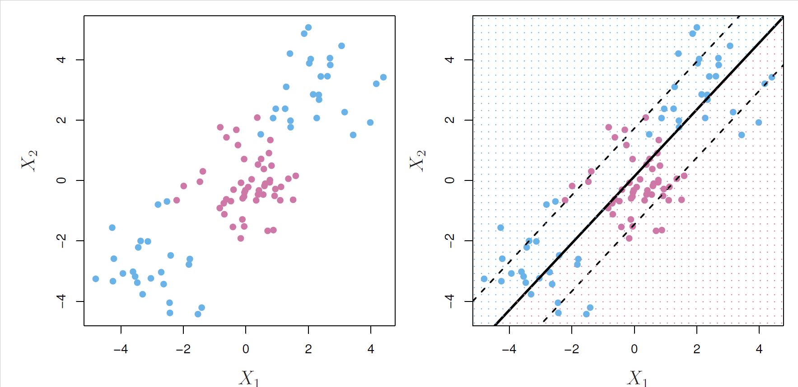
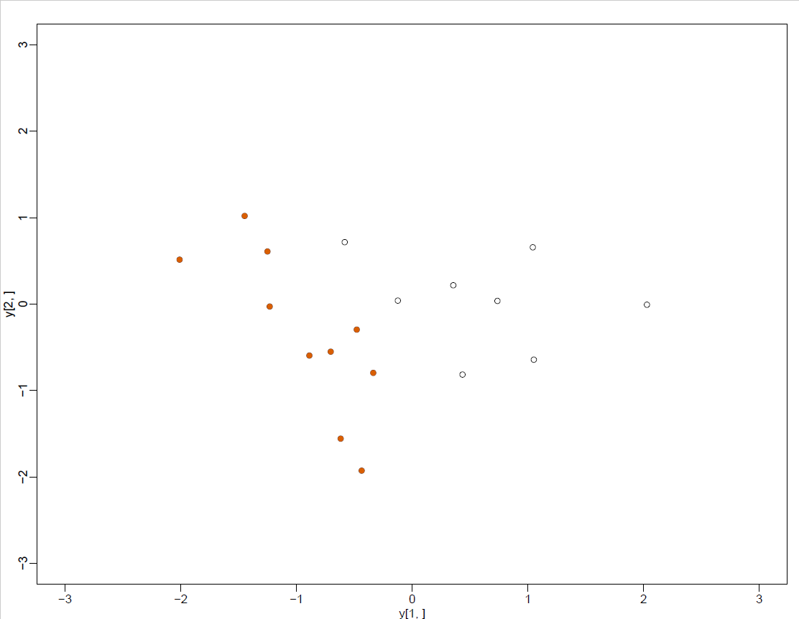
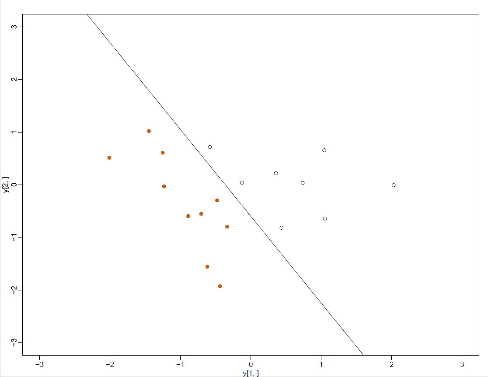
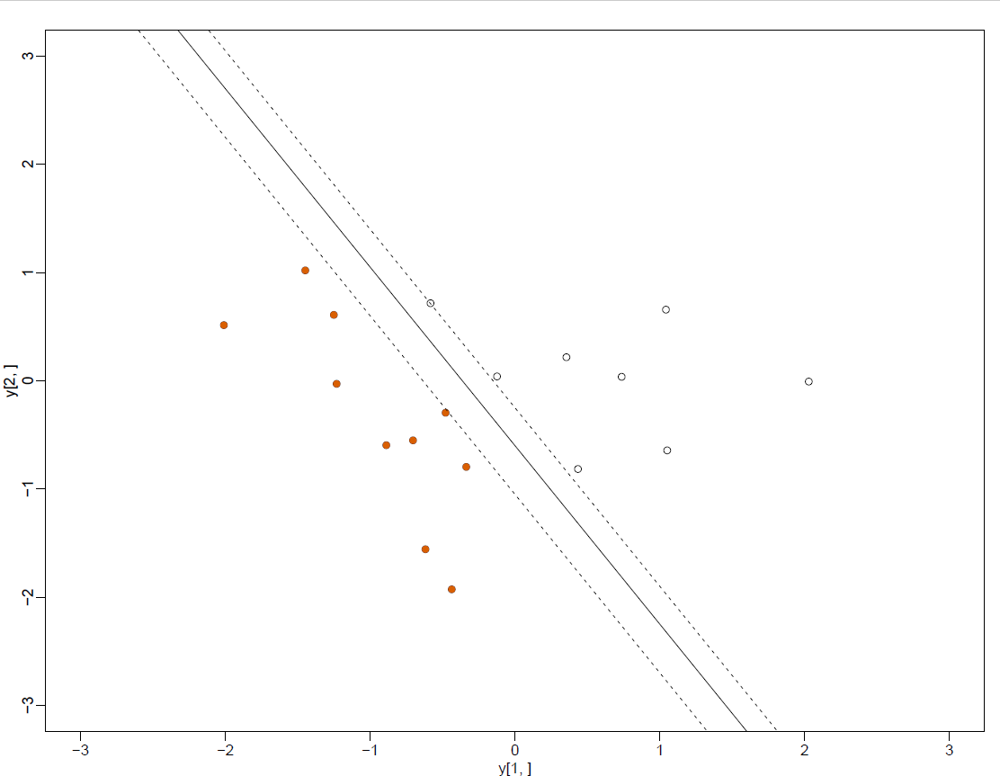
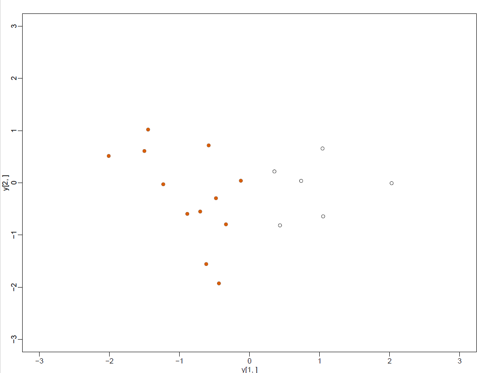
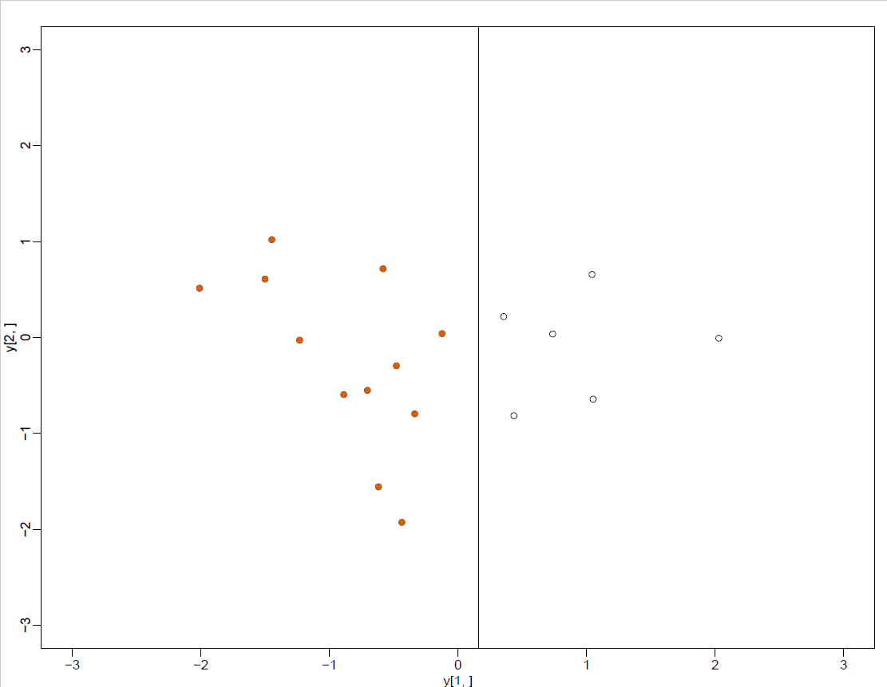
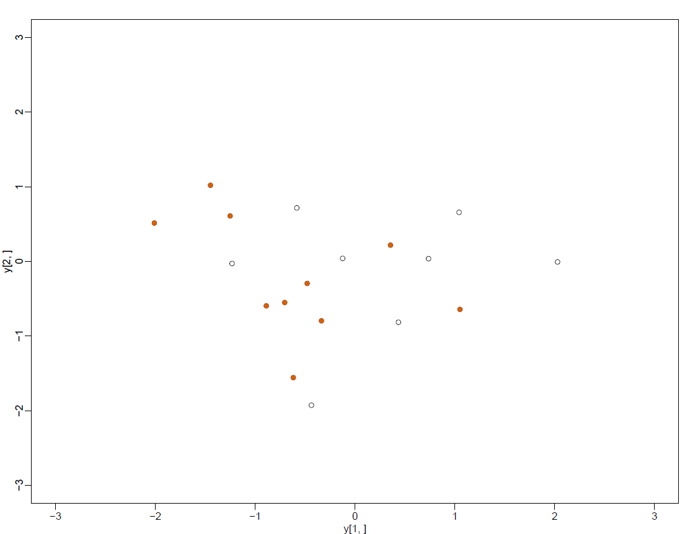
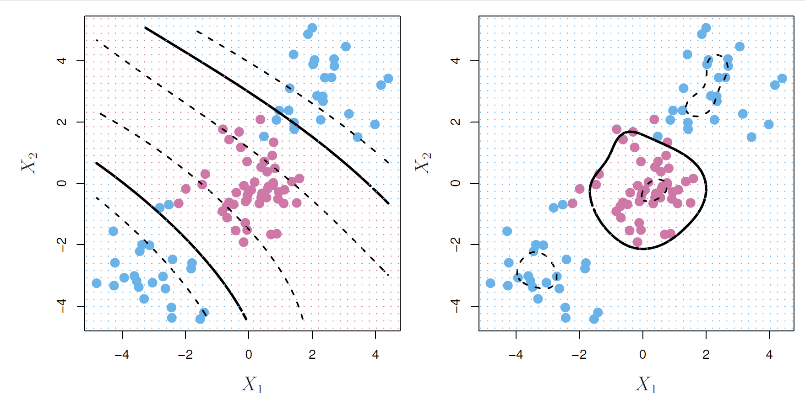

```{r setup, include=FALSE}
knitr::opts_chunk$set(echo = TRUE)
```

Today we are going to learn about a few more techniques for supervised learning, then we will go into techniques for unsupervised learning.

## More on Supervised Learning

### k-Nearest Neighbor Classification

Another technique is the k-nearest neighbor technique, which is pretty intuitive. Let's say that we have some old observations with outcome variables and associated predictor variables. What the procedure does is place all of the know predictor variables out there in space, then place the point where the predictor variables for the new observation fall. We will then calculate a distance in that space between the new point and the other points. We will then use the k-closest observations close to the new point, and calculate a predicted value for the new point as an average of the outcome variables for those k-nearest neighbors. We typically use Euclidean distance for this calculation. 

We can use the `knn` function in the `class` package to do this. We will have to decide what value of k we are going to use. 

Let's return now to the NHANES Diabetes dataset from last week. 

```{r}
library(tidyverse)
library(class)
library(rpart)
library(NHANES)
library(RColorBrewer)
library(plot3D)
library(parallel)
library(randomForestSRC)
library(ggRandomForests)
library(mosaic)

# Create the NHANES dataset again

people <- NHANES %>% dplyr::select(Age, Gender, Diabetes, BMI, HHIncome, PhysActive) 
#%>% na.omit()

glimpse(people)


# What is the marginal distribution of Diabetes?

tally(~ Diabetes, data = people, format = "percent")
```


```{r}
class(people)

# Convert back to dataframe
people <- as.data.frame(people)
glimpse(people)

# Convert factors to numeric - the packages just seem to work better that way
people$Gender <- as.numeric(people$Gender)
people$Diabetes <- as.numeric(people$Diabetes)
people$HHIncome <- as.numeric(people$HHIncome)
people$PhysActive <- as.numeric(people$PhysActive)

people <- na.omit(people)

glimpse(people)
```


Now for the procedure

```{r}
# Apply knn procedure to predict Diabetes

# Let's try different values of k to see how that affects performance
knn.1 <-
  knn(
    train = people,
    test = people,
    cl = as.numeric(people$Diabetes),
    k = 1
  )
knn.3 <-
  knn(
    train = people,
    test = people,
    cl = people$Diabetes,
    k = 3
  )
knn.5 <-
  knn(
    train = people,
    test = people,
    cl = people$Diabetes,
    k = 5
  )
knn.20 <-
  knn(
    train = people,
    test = people,
    cl = people$Diabetes,
    k = 20
  )

# knn.1
# knn.3
# knn.5
# knn.20
```

Now let's see how well it classifies

```{r}
# Calculate the percent predicted correctly

100*sum(people$Diabetes == knn.1)/length(knn.1)
100*sum(people$Diabetes == knn.3)/length(knn.3)
100*sum(people$Diabetes == knn.5)/length(knn.5)
100*sum(people$Diabetes == knn.20)/length(knn.20)
```

We see that as k increases, the prediction worsens, but this will not always be the case.

What about success overall?

```{r}
# Another way to look at success rate against increasing k

table(knn.1, people$Diabetes)
table(knn.3, people$Diabetes)
table(knn.5, people$Diabetes)
table(knn.20, people$Diabetes)
```

So which classifier should you choose? Well, the good news is that you don't have to. There is what is called an ensemble method, in which you run several classifiers, then take the majority vote. We are also going to do this over a grid covering the *Age x BMI* space, so that we can do visualize the results from each classifier.

```{r}
# Create the grid
ages <- range(~ Age, data = people)
bmis <- range(~ BMI, data = people)
res <- 100
fake_grid <- expand.grid(
  Age = seq(from = ages[1], to = ages[2], length.out = res),
  BMI = seq(from = bmis[1], to = bmis[2], length.out = res))

#Get the overall proportion, p, of Diabetics

p <- sum(people$Diabetes == 1)/length(people$Diabetes)

# Null model prediction

pred_null <- rep(p, nrow(fake_grid))

# reinitialize the people dataset - fix Diabetes
# back to factor of "Yes" and "No"

#people <- NHANES[, c("Age", "Gender", "Diabetes", 
#                     "BMI", "HHIncome", "PhysActive")]
#people <- na.omit(people)
#people <- as.data.frame(people)

people <- NHANES %>% 
  dplyr::select(Age, Gender, Diabetes, 
                BMI, HHIncome, PhysActive) %>% 
  na.omit()

form <- as.formula("Diabetes ~ Age + BMI")

# Evaluate each model on each grid point
# For the decision tree

dmod_tree <-
  rpart(form,
        data = people,
        control = rpart.control(cp = 0.005, minbucket = 30))

# For the forest

set.seed(20371)
#dmod_forest <- rfsrc(form, data = people, 
#                     ntree = 201, mtry = 3)
# try with randomForest instead of randomForestSRC package
library(randomForest)
dmod_forest <- randomForest(form,
                            data = people,
                            ntree = 201,
                            mtry = 2)

# Now the predictions for tree and forest
pred_tree <- predict(dmod_tree, newdata = fake_grid)[, "Yes"]

# pred_tree <- predict(dmod_tree, newdata = fake_grid)[, 1]
pred_forest <- predict(dmod_forest, newdata = fake_grid,
                       type = "prob")[, "Yes"]

# K-nearest neighbor prediction
pred_knn <- people %>%
  select(Age, BMI) %>%
  knn(
    test = select(fake_grid, Age, BMI),
    cl = people$Diabetes,
    k = 5
  ) %>%
  as.numeric() - 1
```

Next, we want to build a dataframe with all of these predicted models, then `gather()` it into a long format.

```{r}
# build the data frame
res <- fake_grid %>%
  mutate(
    "Null" = pred_null,
    "Decision Tree" = pred_tree,
    "Random Forest" = pred_forest,
    "K-nearest neighbor" = pred_knn
  ) %>%
  gather(k = "model", value = "y_hat",-Age,-BMI)
```

Next let's plot all of these

```{r}
ggplot(data = res, aes(x = Age, y = BMI)) +
  geom_tile(aes(fill=y_hat), color = NA) +
  geom_count(aes(color = Diabetes), alpha = 0.4, data = people) +
  scale_fill_gradient(low = "white", high = "blue") +
  scale_color_manual(values = c("gray", "gold")) +
  scale_size(range = c(0,2)) +
  scale_x_continuous(expand = c(0.02, 0)) +
  scale_y_continuous(expand = c(0.02, 0)) +
  facet_wrap(~model)

length(pred_knn)
length(pred_tree)
length(pred_forest)
```

All of the work that we have done with trees and forests is all fine and good except that it assumes that your division is linear. So what do you do if your data look like this graph brazenly borrowed from Gareth James?



Or like this graph also brazenly borrowed from Gareth James?



The K-nearest neighbor approach will help with the first predicament. 
But for the second predicament we are going to need something different.

And now for something different...

Suppose that we have data that look like thus:



These data can be perfectly separated by a hyperplane (in 2-dimensions, this is a line), like so:



This line is the one that is the furthest from the closest points of either group, and it is called the Maximal Margin Classifier, that is, the margins to the closest points are as large as possible for any line that you could draw, as so:



This classifier will only work if you can draw a hyperplane to separate the groups.

The problem with MMC's - they are very sensitive to the tiny changes in the data. For instance, look at the figure below. There is only 1 point that is different from the previous scatterplot.



Yet, that causes a huge change in the MMC, as shown below:



What if your data look like this:



For these data you can't draw a line that separates them.

What to do?

### Support Vector Classifiers

The goal is to create a classifier created based on a hyperplane that may not perfectly separate classes but does offer greater robustness to the effects of individual observations, and better classification of most of the training observations. The *support vector classifier* does exactly that. This is sometimes called a *soft margin classifier* 

Recall our MMC. It could be that a classifier like this might actually work - it classifies 5 wrong, but gets most right, and it should be fairly robust. The support vectors in this case are the dashed lines. The objective is to minimize prediction error, but we can allow some values to be on the incorrect side of the margin or even the incorrect side of the hyperplane. In that case the margins are considered "soft". 

### Support Vector Machines

All of that is fine and good, but what if we have data that look as follows (brazenly borrowed by Gareth James):


As we see on the left there appear to be at least 2, maybe 3 groups. And, as we see on the right, an SVC is useless.

So we have to think about using *non-linear* boundaries instead, as shown below (brazenly borrowed by Gareth James):



So we will want to *enlarge* our feature space by using functions of our features, in particular, polynomial terms, in order to develop these boundaries. We will do this by using what is called a *kernel* function. The definition of a kernel is beyond the scope of this class. But it turns out that there are computational methods to produce these extended features in a computationally efficient manner, and that the linear SVC can be represented by these features as well. All of this will only involve what is called the inner product of two observations. For two observations X_i and X_{i'} the inner product is

\begin{equation}

<X_i, X_{i'}> = \sum_{j=1}^{p} {x_{ij}x_{i'j}}

\end{equation}

Let's look at an example or two. Consider the Khan dataset in the ISLR package. It contains expression levels for a number of genes corresponding to four types of small round blue cell tumors. There is a set of training data and a set of testing data.

```{r}
# Call up ISLR, which contains the dataset, and e1071, which contains the function for fitting an SVM
library(ISLR)
library(e1071)

# What is in the Khan data set?
names(Khan)

# What are the dimensions of the objects in the Khan dataset?
dim(Khan$xtrain)
dim(Khan$xtest)
dim(Khan$ytrain)
dim(Khan$ytest)

# How do the observations in the training and testing datasets distribute among the tumor type classes?
table(Khan$ytrain)
table(Khan$ytest)
```

We will use a support vector approach to predict tumor type from gene expression levels. 

There are a very large number of features relative to the number of observations. In this case, we should use a linear kernel.

```{r}
# Create the data frame consisting of the training data
dat <- data.frame(x=Khan$xtrain, y = as.factor(Khan$ytrain))

# Run the svm() function on the training data using a linear kernel
out <- svm(y~., data = dat, kernel = "linear")

# What is in this new object created by the svm() function?
summary(out)

# How well does this SVM predict the training data?
table(out$fitted, dat$y)
```

We see that there are no training errors. This is not surprising, since the large number of features relative to observations guarantees that you can find any number of hyperplanes that will fully separate the observations. 

So what about the SVM's performance on the test observations?

```{r}
# Create the dataframe for the testing data
dat.test <- data.frame(x=Khan$xtest, y= as.factor(Khan$ytest))

# Use the SVM we just created to classify the test dataset
pred.test <- predict(out, newdata = dat.test)

# How well does this SVM do at classifying the test dataset?
table(pred.test, dat.test$y)
```

We see that there are 2 errors, or a 10% error rate.

