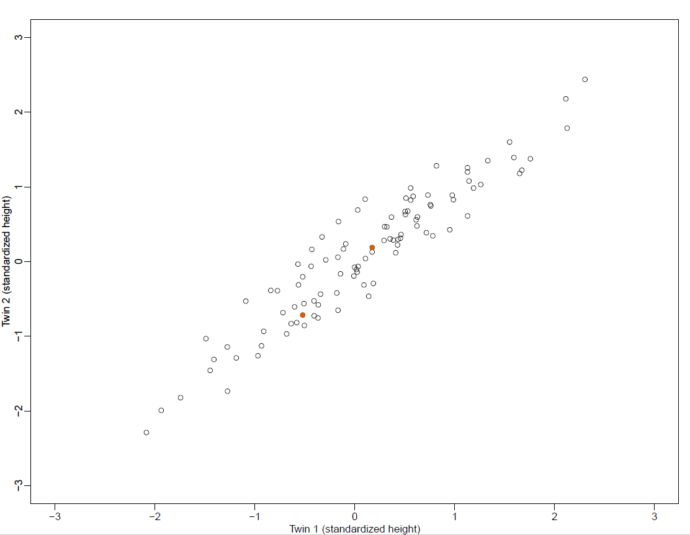
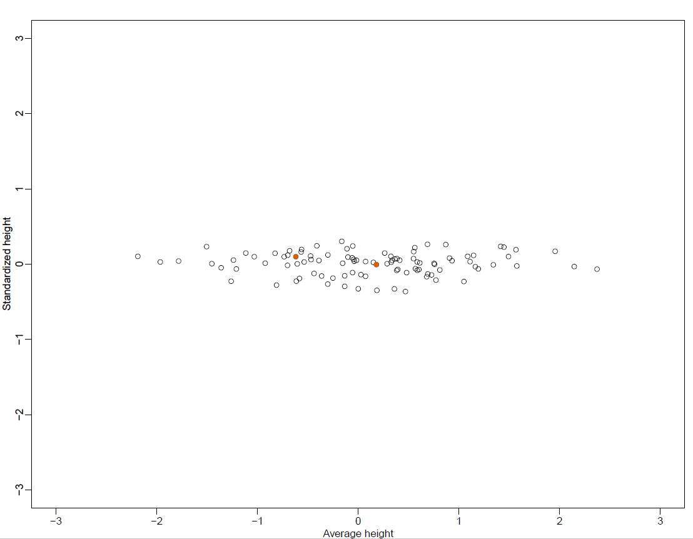

```{r setup, include=FALSE}
knitr::opts_chunk$set(echo = TRUE)
```

```{r}
library(tidyverse)
library(class)
library(rpart)
library(NHANES)
library(RColorBrewer)
library(plot3D)
library(parallel)
library(randomForestSRC)
library(ggRandomForests)
library(mosaic)
```

## Unsupervised learning

For Act III today we will talk about unsupervised learning - that is we want to discover patterns in the data without an *a priori* understanding of any grouping structure.

There are a couple of ways to do this. We will talk about k-means clustering and principal components analysis (PCA).

## Clustering

You have probably all seen an example of an evolutionary tree - sometimes also called a dendogram. Although biologists will imagine that at each branching point there was an actual being (plant or animal), the descendants of whom split into groups that evolved in different directions. They will group similar beings close to each other, and not-so-similar ones at further distances. But you will note that there is no outcome variable - just decisions as to what is close and what is far with respect to relatedness.

In general you can use trees to describe the similarity between objects, regardless of how they came to be. The tree may or may not be a reflection of something deeper about the objects and their relationships - it can just be a simple way to visualize relationships.

To develop these trees from a set of numerical variables, none of which constitutes a *response* you would need to plot the data as points in space then make branches based on how close together points are. This technique is called _hierarchical clustering_.

The `NCI60` dataset contains microarray gene expression levels on 6830 genes for 68 cancer cell lines. Although cancer cell type is recorded, we are going to explore how the data group without considering this variable, then look at how closely the *de novo* grouping compares to the cell types. The data come from the publication by Ross et al (Nature Genetics, 2000). The dataset is available in the `ISLR` package. The `ape` package contains many functions for phylogenetic trees.

```{r}
library(tidyverse)
library(maps)
library(ISLR)
library(ape)

nci.labs <- NCI60$labs # Labels for checking later
nci.data <- NCI60$data

# What do the data look like?
dim(nci.data)
length(nci.labs)
nci.labs[1:4]
table(nci.labs)

# Scale the data before clustering
sd.data <- scale(nci.data)

# Calculate Euclidean distance between each pair of points
data.dist <- dist(sd.data)

# Plot the tree, default linkage is 'complete'
plot(hclust(data.dist), labels = nci.labs, main = "Complete Linkage", xlab = "",
     sub = "", ylab = "")

# Plot the tree, linkage is 'average'
plot(hclust(data.dist), method = "average", labels = nci.labs, main = "Average Linkage", xlab = "", 
     sub = "", ylab = "")

# Plot the tree, default linkage is 'single'
plot(hclust(data.dist), method = "single", labels = nci.labs, main = "Single Linkage", xlab = "", 
     sub = "", ylab = "")
```

How do you think these trees compare?

Which one should we use?

```{r}
# Let's use complete linkage and cut into 4 clusters

hc.out <- hclust(dist(sd.data))
hc.clusters <- cutree(hc.out, 4)
table(hc.clusters, nci.labs)
```

Where are the leukemia cases? What about the breast cancer cases?

Where in the tree is the cut that yielded the 4 clusters?

```{r}
# plot the cut in the tree that yielded the 4 clusters

plot(hc.out, labels = nci.labs)
abline(h=139, col = "red")
```

Let's look at the summary of the tree:

```{r}
# Summary of hierarchical clustering
hc.out
```

### K-means clustering

An alternative method of clustering is _K-means clustering_. Again, we place our points in space, and decide on groups, but we do so without consideration of hierarchy. 

Let's see how these two types of clustering compare on the `NCI60` dataset:

```{r}
# K-means clustering with K=4 (from the hierarchical clustering number)
set.seed(40523)
km.out = kmeans(sd.data, 4, nstart = 20)
km.clusters = km.out$cluster
table(km.clusters, hc.clusters)
```

How do the clustering methods compare?

Which clusters are found by both methods?

### Another example

Let's look at another example. We have data about the cities in the world in the dataset`WorldCities`. For the 4000 largest cities, considering *only* latitude and longitude (two of the *features* of this dataset), how would these data items group and plot?

```{r}
#get the 4000 largest cities, variables are only latitude and longitude

BigCities <- world.cities %>%
  arrange(desc(pop)) %>%
  head(4000) %>%
  dplyr::select(long, lat)
glimpse(BigCities)
```

Notice that the `BigCities` dataset does not even contain the names of the cities, *just* latitude and longitude.

```{r}
library(mclust)
set.seed(15)
city_clusts <- BigCities %>%
  kmeans(centers = 6) %>%
  fitted("classes") %>%
  as.character()
BigCities <- BigCities %>% mutate(cluster = city_clusts)
BigCities %>% ggplot(aes(x=long, y=lat)) +
  geom_point(aes(color = cluster), alpha = 0.5)
```

### Principal Components Analysis

Another way to learn more about the data is to reduce dimensionality. If you have ever had a course in matrix algebra, one technique to reduce the dimensionality of a matrix is called *Singular Value Decomposition* (SVD). Of course in statistics (unlike in mathematics) data are typically messy, and so we use a tool called *Principal Components Analysis* (PCA) which is, at its core, just SVD.

Let's set the stage with an example. Suppose we have the heights of 100 pairs of twins (or, if you prefer, suppose you have the expression levels of 2 genes for 100 samples). Let's plot them:



You will notice that the data live in two dimensions, but they appear to be somewhat linear. We can _rotate_ this plot so that it makes a bit more sense, but taking the average of the twin heights and plotting it against the difference of the heights. Let's take a look:



The two orange points are the same in each plot, and you will note that the rotation preserves the distance between them.

Now suppose you have expression levels for 1000 genes, and you want to look at their plots. You can't visualize this in 1000 x 1000 space, and if you do them pairwise you will need to examine almost 500,000 graphs. This is just too much. Plus not all of the variables are, well, interesting. So we want to reduce the dimensions.

One other thing to notice about the rotated graph: Most of the "action" is in the first dimension. This is the point, if you will, of PCA. It allows us to summarize our data (our features, our variables) with a smaller number of related variables that explain most of the variability of our original data. That is, PCA gives you a low-dimensional transformation of the data set such that these components contain as much as possible of the variation. It gives you a data representation in a smaller number of dimensions that are as "interesting"" as possible. By *interesting* we mean here the amount of variations of the observations in each dimension.

Just as we did with the example above, we seek a normalized, linear combination of our features that has the highest variance, then the next highest, etc. 

Let's work through an example, continuing our work with the NCI60 dataset:

```{r}
# Find the principal components of the normalized data
pr.out <- prcomp(nci.data, scale = TRUE)

# Color assignment for each of the 64 cell lines
Cols <- function(vec) {
  cols = rainbow(length(unique(vec)))
  return(cols[as.numeric(as.factor(vec))])
}

# Plot the principal component score vectors
par(mfrow = c(1, 2), pin = c(3, 3))
plot(
  pr.out$x[, 1:2],
  col = Cols(nci.labs),
  pch = 19,
  xlab = "Z1",
  ylab = "Z2"
)
plot(
  pr.out$x[, c(1, 3)],
  col = Cols(nci.labs),
  pch = 19,
  xlab = "Z1",
  ylab = "Z3"
)
```

These color plots aren't really all that interesting nor are they particularly informative.

But wait, there's more!

Each component has a value associated with it that is the percent of variance explained (PVE).

```{r}
# See what all is in the object
summary(pr.out)

plot(pr.out)

pve = 100 * pr.out$sdev ^ 2 / sum(pr.out$sdev ^ 2)
pve
plot(
  pve,
  type = "o",
  ylab = "Cumulative PVE",
  xlab = "Principal Component",
  col = "blue"
)
plot(
  cumsum(pve),
  type = "o",
  ylab = "Cumulative PVE",
  xlab = "Principal Component",
  col = "brown3"
)
```


You will notice from the first plot that there is a drop-off (elbow) in PVE from component 6 to 7. Also you will notice in the histogram that there is a substantial dropoff in PVE going from component 1 to 2. So you can safely reduce this dataset to representation by at most 6 components, and if you feel like living dangerously, to 2 components.  These are called scree plots. You should definitely look at these scree plots as you evaluate the results of a principal components analysis, and you should ask to see them as well for any that you happen upon in your reading.

### Multi-dimensional scaling

Another unsupervised learning technique is Multi-dimensional Scaling (MDS). We want to know about differences between observations. So, for instance, let's consider the Khan dataset again. We are going to take differences of the individual observations and the overall mean, then we are going to use PCA again to examine the results. Except, since we are doing this on the observation - mean differences, it is no longer strictly PCA, and it is not called *Principal Coordinate Analysis* or PCoA. But the principles from PCA are still useful - we are going to use the first two principal *coordinates* to plot, because those will capture most of the variability in these differences.

```{r}
# Use the nci.data set again
# Assume we have N observations and p variables in an N x P dataset
dim(nci.data)

d <- dist(nci.data)
fit <- cmdscale(d, eig = TRUE, k = 2)

# k is the number of principal coordinates we want
# view the results
fit

# plot it
x <- fit$points[, 1]
y <- fit$points[, 2]

plot(
  x,
  y,
  xlab = "PCo1",
  ylab = "PCo2",
  main = "Metric MDS",
  type = "n"
)
text(x, y, labels = nci.labs, cex = 0.7)
```

We can also do what is called nonmetric MDS, using a function from the MASS package.

```{r}
library(MASS)

fit <- isoMDS(d, k = 2)

x <- fit$points[, 1]
y <- fit$points[, 2]

plot(
  x,
  y,
  xlab = "PCo1",
  ylab = "PCo2",
  main = "nonMetric MDS",
  type = "n"
)
text(x, y, labels = nci.labs, cex = 0.7)
```


